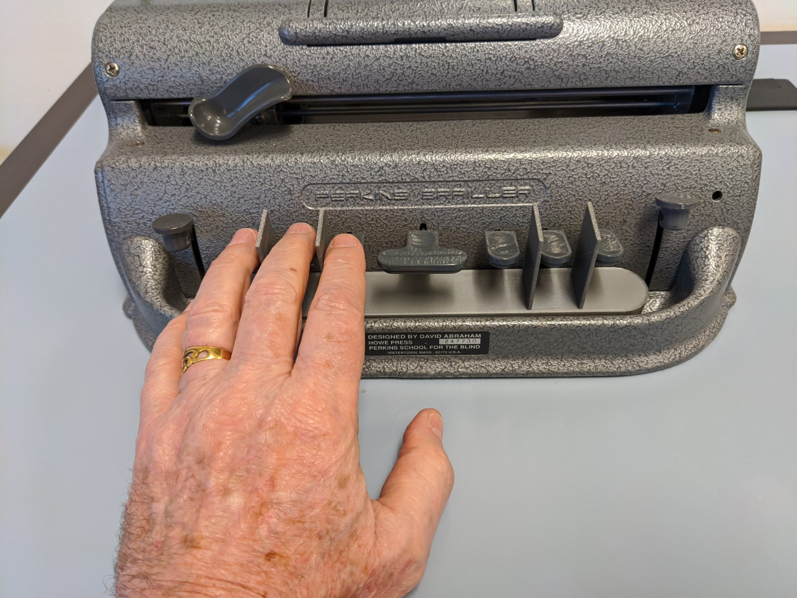

# Brailler Guide
Laser cut and 3D printable brailler guides. Includes parametric design for laser cutting (see .SCAD file) and two 3D printable versions.

Laser cut version takes around 1.5 minutes to cut and requires glue to assemble, 3D printed version takes aroudn 3 hours to print. Recommended printing lying, flat not on base.

